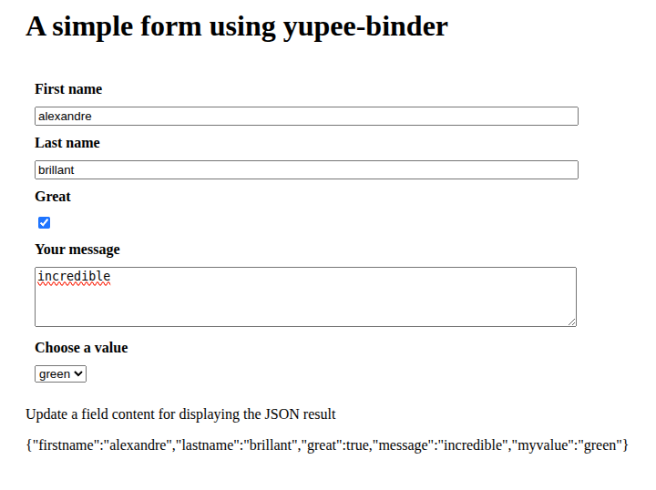
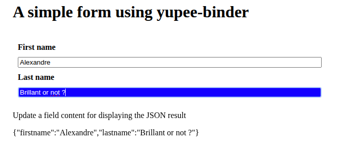
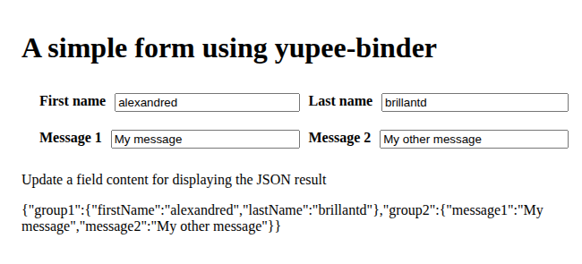
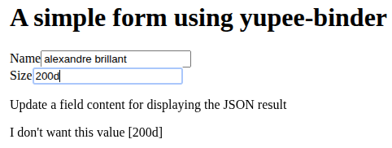
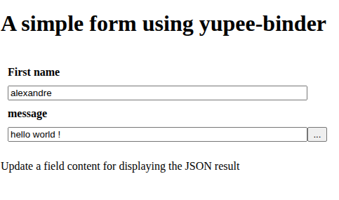

# yupee-binder

Yupee Binder is a module of the [Yupee library](https://github.com/AlexandreBrillant/yupee). This module can also be used independently.

It is designed to quickly create forms from a literal object. Essentially, the object's properties are automatically bound to readable/writable form fields. The object is updated in real time whenever a field is modified. This effectively converts user input into a JavaScript object.

## Basic Example with Different Fields

You just need to use the **createGroup** method. As a parameter, specify the HTML node that contains all the objects and/or the data object and/or the className for the group. This parameter is an object **{ container:..., data:..., className:... }**

Then, add each field using the **createField** method with an object parameter containing the following properties:

- `label`: Label associated with the component
- `name`: Property of the resulting object
- `format`: Represents the type of field:
  - `window.binder.TEXT_LINE` (default text field)
  - `window.binder.TEXT_BLOC` (multi-line text field)
  - `window.binder.BOOLEAN` (checkbox)
  - `window.binder.LIST` (combobox). For this case, the default value must contain an array of values; the first value in this array is the default value.
- `required`: Optional, defaults to `true`
- `defaultValue`: Optional, used to initialize the field value. Otherwise, this value is taken from the object associated with the group.

The **createField** method returns an object containing the component (`field`) and the label (`label`). You can modify certain properties of your field at this point. For example, with a `TEXT_BLOC`, you can change the number of columns or rows.

The **onUpdate** method is used to receive real-time updates for any changes made in a field.



```html
<!DOCTYPE html>

<!-- Basic sample for the yupee-binder.js management -->

<html>
    <head>
        <style type="text/css">
            /* All the group of field */
            div.yupee-binder-group {
                padding:10px;
            }
            div.yupee-binder-group div.yupee-binder-field label {
                display:block;
                font-weight:bold;
                margin-bottom:10px;
                margin-top:10px;
            }
            div.yupee-binder-field input[type=text], div.yupee-binder-field textarea {
                width:90%;
            }
        </style>
        <script src="../src/yupee-binder.js"></script>
        <script>
            document.addEventListener( "DOMContentLoaded", () => {
                // Build a new form and put in into the <div id='myForm'/>
                const myFields = window.binder.createGroup( {container:document.querySelector( "#myForm" ) } );
                
                // Create a simple text field
                myFields.createField( { label:"First name", name:"firstname", format:window.binder.TEXT_LINE, required:true, defaultValue:"alexandre" } );
                myFields.createField( { label:"Last name", name:"lastname", format:window.binder.TEXT_LINE, required:true, defaultValue:"brillant" } );
                
                // Create a checkbox
                myFields.createField( { label:"Great", name:"great", format:window.binder.BOOLEAN, required:true, defaultValue:true } );
                
                // Create a textarea
                // We update the default rows getting the field result part
                const { field } = myFields.createField( { label:"Your message", name:"message", format:window.binder.TEXT_BLOC, required:true, defaultValue:"nice message" } );
                field.rows = 4;

                // Create a selection
                myFields.createField( { label:"Choose a value", name:"myvalue", format:window.binder.LIST, required:true, defaultValue:["red","green","blue"] });

                // Get an update event each time the form is updated
                myFields.onUpdate( () => {
                    // Display the json result
                    document.querySelector( "#result" ).textContent = JSON.stringify( myFields.result() );
                } );

            } );
        </script>
    </head>

    <body>

        <h1>A simple form using yupee-binder</h1>
        
        <div id="myForm">

        </div>

        <p>Update a field content for displaying the JSON result</p>

        <div id="result">

        </div>

    </body>

</html>
```

You can customize the appearance of your group or fields using the CSS classes `yupee-binder-group` and `yupee-binder-field`.

## Updating a Field

The **onBinding** method is used to receive a notification each time a component is created. Here, we use it to change the color of a specific field.



```html
<!DOCTYPE html>

<!-- Cutomization sample for the yupee-binder.js management -->
<!-- We update a field color and we use a specific objet -->

<html>
    <head>
        <style type="text/css">
            /* All the group of field */
            div.yupee-binder-group {
                padding:10px;
            }
            div.yupee-binder-group div.yupee-binder-field label {
                display:block;
                font-weight:bold;
                margin-bottom:10px;
                margin-top:10px;
            }
            div.yupee-binder-field input[type=text], div.yupee-binder-field textarea {
                width:90%;
            }
        </style>
        <script src="../src/yupee-binder.js"></script>
        <script>

            const myData = {
                firstname:"Alexandre",
                lastname:"Brillant"
            }

            document.addEventListener( "DOMContentLoaded", () => {
                // Build a new form and put in into the <div id='myForm'/>
                // We use only the myData object
                const myFields = window.binder.createGroup( { container:document.querySelector( "#myForm" ), data:myData } );
                myFields.onBinding( ( { name, field } ) => {
                    if ( name == "lastname" ) {
                        field.style.backgroundColor = "blue";
                        field.style.color = "white";
                    }
                } );

                // Create a simple text field
                myFields.createField( { label:"First name", name:"firstname", format:window.binder.TEXT_LINE } );
                myFields.createField( { label:"Last name", name:"lastname", format:window.binder.TEXT_LINE } );

                // Get an update event each time the form is updated
                myFields.onUpdate( () => {
                    // Display the json result
                    document.querySelector( "#result" ).textContent = JSON.stringify( myFields.result() );
                } );

            } );
        </script>
    </head>

    <body>

        <h1>A simple form using yupee-binder</h1>
        
        <div id="myForm">

        </div>

        <p>Update a field content for displaying the JSON result</p>

        <div id="result">

        </div>

    </body>

</html>

```

## Creating Groups

You can add as many groups as needed. For each group, you can define a CSS class to customize its display (for example, inline instead of column).

In this example, the data consists of two sub-objects. Each sub-object is associated with a field group. We also specify custom CSS classes, **group1** and **group2**, to modify the field layout so they appear in columns.



```html
<!DOCTYPE html>

<!-- We use two groups of fields -->

<html>
    <head>
        <style type="text/css">
            .group1, .group2 {
                display:flex;
                flex-direction: row;
                padding:10px;
            }

            .group1 > div {
                width:50%;
                display:flex;
                flex-direction: row;
            }

            .group2 > div {
                width:50%;
                display:flex;
                flex-direction: row;

            }

            label {
                font-weight: bold;
                margin-right:10px;
                margin-left:10px;
            }

            input {
                flex-grow: 1;
            }

        </style>
        <script src="../src/yupee-binder.js"></script>
        <script>

            const myData = {
                group1: {
                    firstName : "alexandre",
                    lastName : "brillant"
                },
                group2: {
                    message1 : "My message",
                    message2 : "My other message"
                }
            }

            document.addEventListener( "DOMContentLoaded", () => {
                const container = document.querySelector( "#myForm" );
                const myGroup1 = window.binder.createGroup( { container, data:myData.group1, className:"group1" } );
                myGroup1.createField( { label:"First name", name:"firstName" } );
                myGroup1.createField( { label:"Last name", name:"lastName" } );

                const myGroup2 = window.binder.createGroup( { container, data:myData.group2, className:"group2" } );
                myGroup2.createField( { label:"Message 1", name:"message1" } );
                myGroup2.createField( { label:"Message 2", name:"message2" } );

                myGroup1.onUpdate( () => {
                    // Display the json result
                    document.querySelector( "#result" ).textContent = JSON.stringify( myData );
                } );
                myGroup2.onUpdate( () => {
                    // Display the json result
                    document.querySelector( "#result" ).textContent = JSON.stringify( myData );
                } );


            } );
        </script>
    </head>

    <body>

        <h1>A simple form using yupee-binder</h1>
        
        <div id="myForm">

        </div>

        <p>Update a field content for displaying the JSON result</p>

        <div id="result">

        </div>

    </body>

</html>

```

## Validation

You can add a **validator** property to your field. This property is a function that takes the user-input value as an argument and returns `true` if the value is valid and `false` otherwise.

Similarly, you can automatically convert the input value using the **formatter** property. This property is a function that takes the value as an argument and returns the desired final value.

In this example, a field is an integer. We validate that the user enters a number and automatically convert it to an integer.

Note that you can use **onError** to receive real-time input validation errors.

In this example, we ensure that only an integer is accepted as the final value for the **size** field.



```html
<!DOCTYPE html>

<!-- We use two groups of fields -->

<html>
    <head>
        <script src="../src/yupee-binder.js"></script>
        <script>

            const myData = {
                name:"alexandre brillant",
                size:200
            }

            document.addEventListener( "DOMContentLoaded", () => {
                const container = document.querySelector( "#myForm" );
                const myGroup = window.binder.createGroup( { container:document.querySelector( "#myForm" ), data:myData } );
                myGroup.createField( { label:"Name", name:"name" } );
                myGroup.createField( { label:"Size", name:"size", validator:(value)=>!isNaN(Number(value)), formatter:(value)=>parseInt(value) } );

                myGroup.onUpdate( () => {
                    // Display the json result
                    document.querySelector( "#result" ).textContent = JSON.stringify( myData );
                } );

                myGroup.onError( ( { name, value } ) => {
                    document.querySelector( "#result" ).textContent = "I don't want this value [" + value + "]";
                } );

            } );
        </script>
    </head>

    <body>

        <h1>A simple form using yupee-binder</h1>
        
        <div id="myForm">

        </div>

        <p>Update a field content for displaying the JSON result</p>

        <div id="result">

        </div>

    </body>

</html>
```

## Virtual

In the virtual mode, you needn't to specify a container. Just use an empty object {} as a parameter (or with data/className). After you can use the inner panel anywhere using the **container()** method.

```html
<!DOCTYPE html>

<!-- Virtual mode for creating a default container and put it after anywhere -->

<html>
    <head>
        <style type="text/css">
            /* All the group of field */
            div.yupee-binder-group {
                padding:10px;
            }
            div.yupee-binder-group div.yupee-binder-field label {
                display:block;
                font-weight:bold;
                margin-bottom:10px;
                margin-top:10px;
            }
            div.yupee-binder-field input[type=text], div.yupee-binder-field textarea {
                width:90%;
            }
        </style>
        <script src="../src/yupee-binder.js"></script>
        <script>
            document.addEventListener( "DOMContentLoaded", () => {
                // Virtual usage !
                const myFields = window.binder.createGroup( {} );
                
                // Create a simple text field
                myFields.createField( { label:"First name", name:"firstname", format:window.binder.TEXT_LINE, required:true, defaultValue:"alexandre" } );
                myFields.createField( { label:"Last name", name:"lastname", format:window.binder.TEXT_LINE, required:true, defaultValue:"brillant" } );
                
                // Get an update event each time the form is updated
                myFields.onUpdate( () => {
                    // Display the json result
                    document.querySelector( "#result" ).textContent = JSON.stringify( myFields.result() );
                } );

                // Display the container where you want !
                document.getElementById( "myForm" ).appendChild( myFields.container() );
            } );
        </script>
    </head>

    <body>

        <h1>A simple form using yupee-binder</h1>
        
        <div id="myForm">

        </div>

        <p>Update a field content for displaying the JSON result</p>

        <div id="result">

        </div>

    </body>

</html>

```

## Factory

When creating a group, you may specify a factory. A factory is a way to have a different UI component for a specific name.

A factory is a collection of object with the following properties :

- ui : A function returning the DOM node field
- addEventListener : A function called automatically for receiving event that the ui field has been updated

In this example, we replace the "message" field by an input field with a button at the end. When clicking on the button, the field is updated.



```javascript
const factory = {
    message: {
        ui: function( { name, format, required, defaultValue } ) {
            const div = document.createElement( "div" );
            div.style.width="100%";
            const field = document.createElement( "input" );
            field.style.width="90%";
            field.name = name;
            
            field.required = required;
            field.value = defaultValue || "";
            div.appendChild( field );
            const button = document.createElement( "button" );
            button.innerText = "...";
            button.addEventListener( "click",
                () => {
                    field.value = "bye bye world !";

                    const event = new Event('input', {
                        bubbles: true,
                        cancelable: true
                    });

                    field.dispatchEvent( event );
                } );
            div.appendChild( button );
            this.field = field;
            return div;
        },
        addEventListener: function( callback ) {
            this.field.addEventListener( "input", callback );
        }
    }
}

// Build a new form and put in into the <div id='myForm'/>
const myFields = window.binder.createGroup( { container:document.querySelector( "#myForm" ), data, factory } );

// Create a simple text field
myFields.createField( { label:"First name", name:"firstname", format:window.binder.TEXT_LINE, required:true, defaultValue:"alexandre" } );
myFields.createField( { label:"message", name:"message", format:window.binder.TEXT_LINE, required:true, defaultValue:"brillant" } );

// Get an update event each time the form is updated
myFields.onUpdate( () => {
    // Display the json result
    document.querySelector( "#result" ).textContent = JSON.stringify( myFields.result() );
} );
```


(c) 2026 Alexandre Brillant